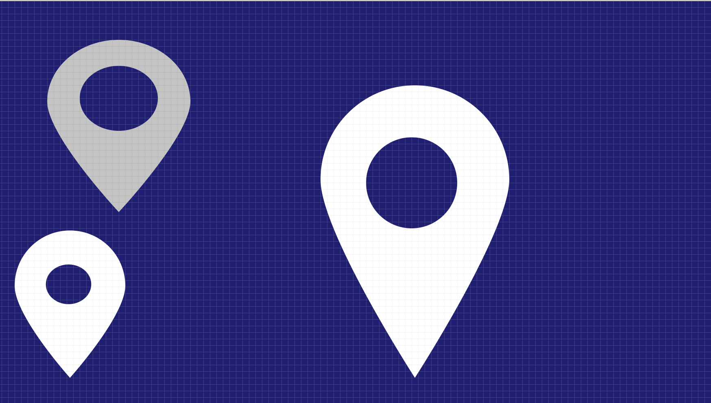

# Day 1 - Draw Map pin in Figma

Steps to draw a map pin:

1. Draw a circle (circle 1) on the artboard using Ellipse from Shapes while pressing the Shift key.
2. Draw another circle (circle 2) inside the circle 1 using either Cmd c (copy) and Cmd v (paste) or Cmd d (duplicate).
3. Adjust the size and position of circle 2 by making it smaller and placing it at the center of circle 1.
4. Select both the circles by clicking on them while pressing the Shift key.
5. Go to Boolean groups > select Subtract selection (this will subtract the area of circle 2 from circle 1)
6. Double click on the area between the two circles (hashing will be displayed meaning it's in editing mode)
7. Now drag straight the bottom anchor/point of circle 1 while pressing Shift key for some distance and then let go.
8. Click on bottom anchor again while pressing the command key.
9. Click Done on the top or press escape
10. To change the size of the inner circle, double click and then press Option + Shift and drag.
11. To change the color of the pin, select the group of shapes (Subtract) by clicking on it and then use Fill to choose a color.
