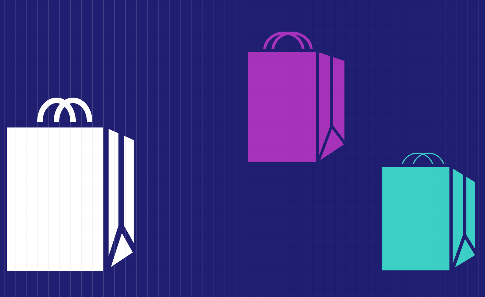
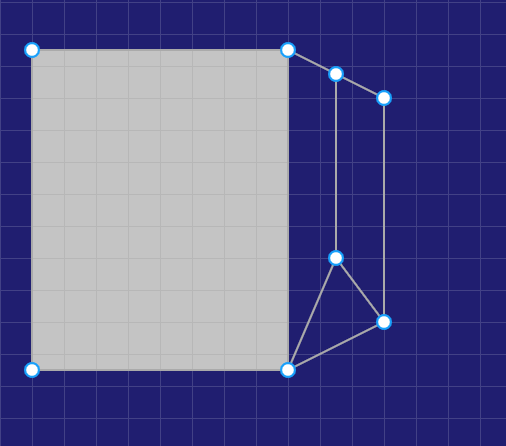
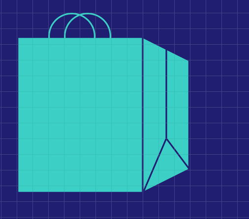

# Day 2 - Shopping bag in Figma

Steps to draw a shopping bag:

1. Draw a rectangle and double click inside it to change it to editing mode (four pointers appear at the corners)
2. Select Pen (P) from Drawing tools
3. To make a 3-D bag, click on the bottom right pointer at the corner of the selected rectangle when using the Pen and then click at a distance to draw a diagonal line. Keep drawing in the same manner to draw a fold in the bag. These lines drawn with Pen as part of the rectangle are called **Vector Networks**.

4. Next use Paint Bucket on the top to fill the same color as the rectangle in the folds drawn.
5. Add Stroke to the whole selection with the same color as the background.
6. Now draw a circle at the top of the rectangle. Add a Stroke to it (same color as the rest of the bag) and remove Fill. Now copy the circle and paste it.

7. Select both the circles at the top while pressing the Shift key. Then right click > select Send backward.
8. Select the whole bag and right click > Group selection.