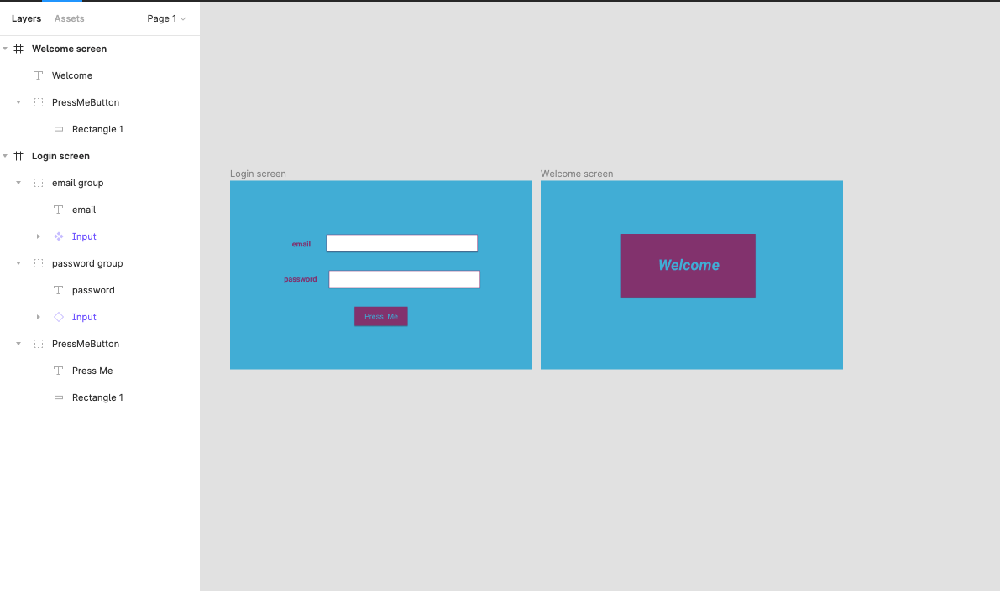
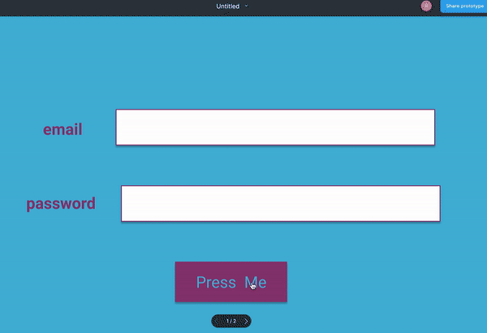

# Day 3 - Desktop login page in Figma

Learnt about:

- **Components**: Inputs are components in the above screenshot. The two white rectangles are made into components (using Right click > Create component) which is basically saying they belong to the same category and can be reused. There's a **Main component** and an **Instance component**. Instance component is the copy of the main component. Any changes made to the Main component will be applied to the instance component(s) as well.
  
- **Prototype** : used to define pathways and interactions between pages/frames.

