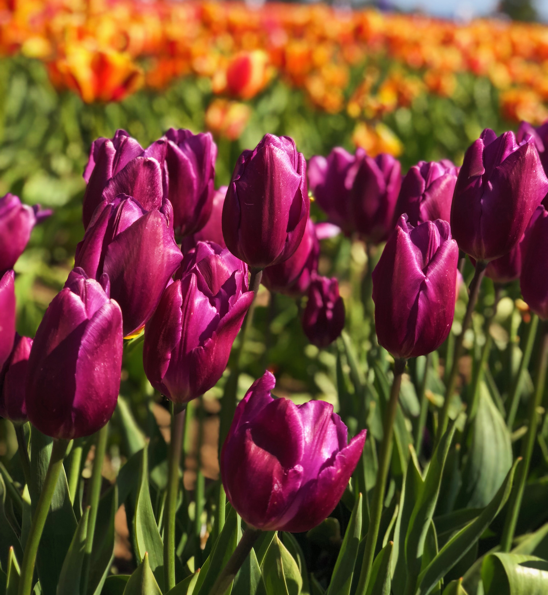

# Day 4 - Color Theory

"Color theory is the creative and scientific use of color."

  
Photo by <a href="https://unsplash.com/@markusspiske?utm_source=unsplash&utm_medium=referral&utm_content=creditCopyText">Markus Spiske</a> on <a href="https://unsplash.com/?utm_source=unsplash&utm_medium=referral&utm_content=creditCopyText">Unsplash</a>
  
## According to traditional color wheel,

### **Primary colors - Red Yellow Blue (RYB)**

  
Photo by <a href="https://unsplash.com/@loggi30?utm_source=unsplash&utm_medium=referral&utm_content=creditCopyText">Ananthan Loggi</a> on <a href="https://unsplash.com/?utm_source=unsplash&utm_medium=referral&utm_content=creditCopyText">Unsplash</a>

- cannot be formed by any combination of other colors

### **Secondary colors - Orange Violet Green**

  
Photo by <a href="https://unsplash.com/@melissaaskew?utm_source=unsplash&utm_medium=referral&utm_content=creditCopyText">Melissa Askew</a> on <a href="https://unsplash.com/?utm_source=unsplash&utm_medium=referral&utm_content=creditCopyText">Unsplash</a>
  

- formed by combining equal mixture of two primary colors
- Orange = Red + Yellow
- Violet = Red + Blue
- Green = Blue + Yellow
  
### **Tertiary colors**

  
Photo by <a href="https://unsplash.com/@ro_ka?utm_source=unsplash&utm_medium=referral&utm_content=creditCopyText">Robert Katzki</a> on <a href="https://unsplash.com/?utm_source=unsplash&utm_medium=referral&utm_content=creditCopyText">Unsplash</a>
  

- formed by combining primary and secondary colors.
- six tertiary colors
- Red-Orange
- Yellow-Orange
- Yellow-Green
- Blue-Green
- Blue-Violet
- Red-Violet

## References

1. <https://www.adobe.com/in/creativecloud/design/discover/secondary-colors.html>
2. <https://www.usability.gov/how-to-and-tools/methods/color-basics.html>
3. <https://blog.tubikstudio.com/color-theory-brief-guide-for-designers/>
4. <https://www.smashingmagazine.com/2010/01/color-theory-for-designers-part-1-the-meaning-of-color/>