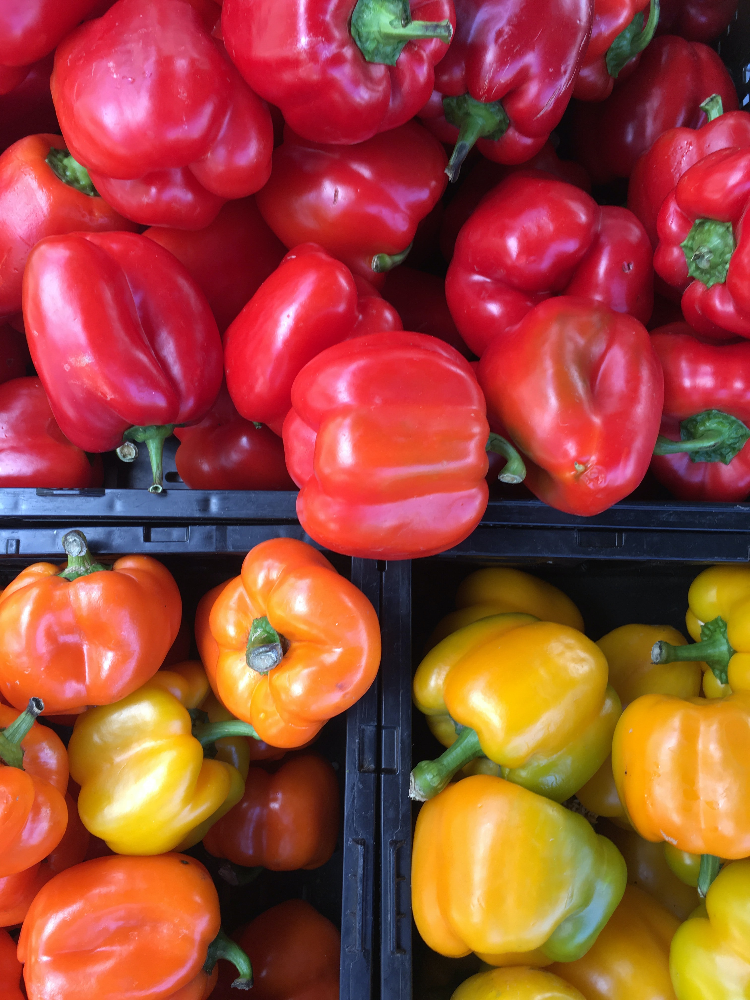
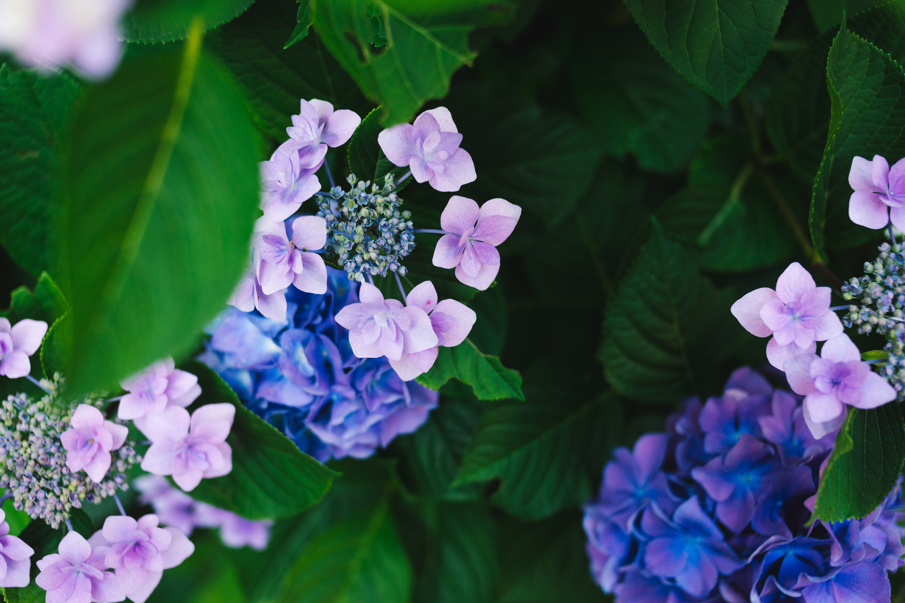

# Day 5 Color Theory - II

## **Color Temperature**

### **Warm colors**

  
Photo by <a href="https://unsplash.com/@andrewscarborough?utm_source=unsplash&utm_medium=referral&utm_content=creditCopyText">Andrew Scarborough</a> on <a href="https://unsplash.com/?utm_source=unsplash&utm_medium=referral&utm_content=creditCopyText">Unsplash</a>

- Warm colors include red, orange, and yellow, and variations of those three colors.

- Warm colors seem closer to the viewer

### **Cool colors**

  
Photo by <a href="https://unsplash.com/@gaspanik?utm_source=unsplash&utm_medium=referral&utm_content=creditCopyText">Masaaki Komori</a> on <a href="https://unsplash.com/?utm_source=unsplash&utm_medium=referral&utm_content=creditCopyText">Unsplash</a>

- Cool colors include green, blue, and purple, and variations of those three colors.

- Cool colors seem farther from the viewer.

### **Neutral colors**
  
Photo by <a href="https://unsplash.com/@cmdrdan?utm_source=unsplash&utm_medium=referral&utm_content=creditCopyText">Dan Ritson</a> on <a href="https://unsplash.com/?utm_source=unsplash&utm_medium=referral&utm_content=creditCopyText">Unsplash</a>

- Neutral colors include black, white, gray, tans, and browns

- Their meanings and impressions depend upon the colors around them.

## **Color Models**

### **Subtractive model**

- CMYK - Cyan, Magenta, Yellow
- colors are created through absorbing wavelengths of visible light
- Used for print media

### **Additive model**

- RGB - Red, Green, Blue
- colors are created through light waves that are added together in particular combinations
- Used for digital and web media

## **Terminology**

### **Hue**

- denotes an object's color

### **Shade**

- when you add black to a particular hue
- For example, dark blue

### **Tint**

- when you add white to a particular hue
- For example, light blue

### **Tone**

- when you add gray (both black and white) to a particular hue
- For example, pastel blue

### **Saturation**

- how hue appears under particular lighting conditions

### **Chroma**

- purity of a color
- brightness of a color in comparison to white

#### References

1. <https://www.adobe.com/in/creativecloud/design/discover/secondary-colors.html>
2. <https://www.usability.gov/how-to-and-tools/methods/color-basics.html>
3. <https://blog.tubikstudio.com/color-theory-brief-guide-for-designers/>
4. <https://www.smashingmagazine.com/2010/01/color-theory-for-designers-part-1-the-meaning-of-color/>
5. <https://www.smashingmagazine.com/2010/02/color-theory-for-designers-part-2-understanding-concepts-and-terminology/>
6. <https://blog.hubspot.com/marketing/color-palette-famous-websites>