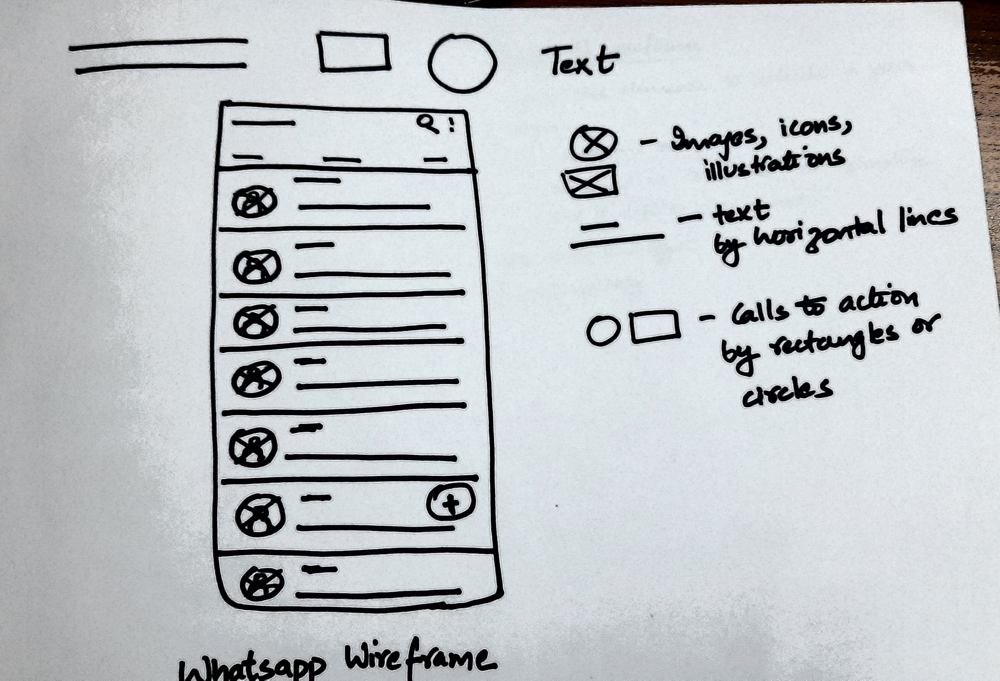

# Day 6 - Wireframes

## **Wireframe**

- rough sketch of user interface

  

## **Benefits**

- inform the elements to include in design
- catch problems early
- get stakeholders to focus on structure
- save time and effort
- iterate quickly

## References

1. <https://balsamiq.com/learn/articles/what-are-wireframes/>
2. Google Design Certificate course on Coursera
