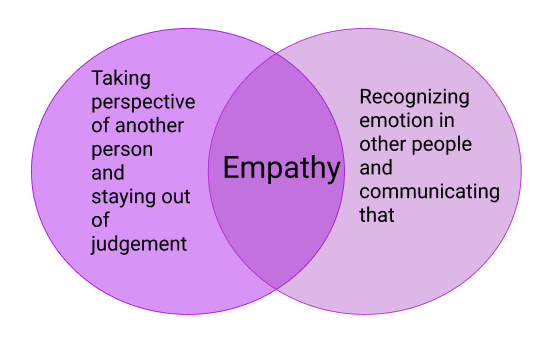
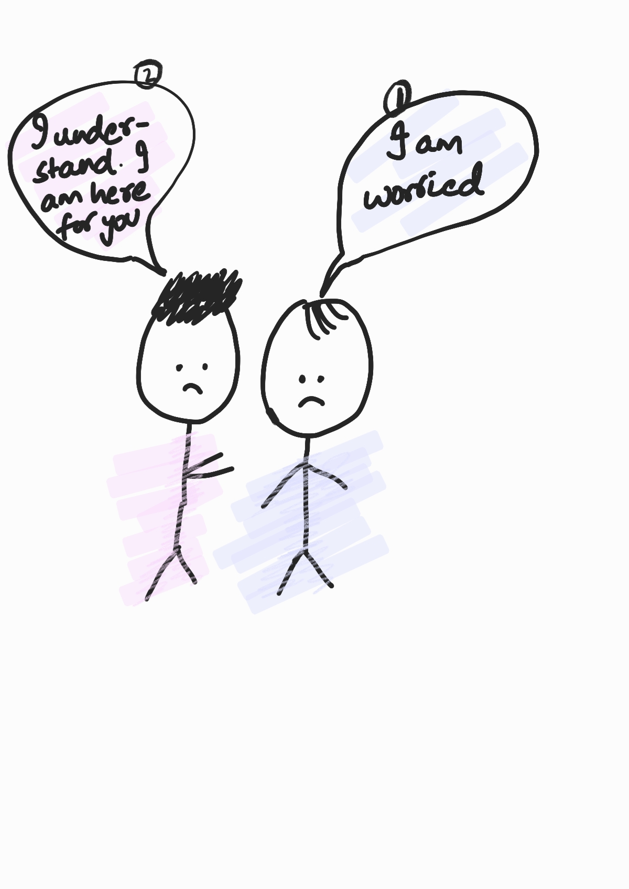

# Day 10 - Empathize

## Empathy

- is feeling with people
- isn't the same as sympathy (feeling sad for)

  

  

- Empathize is the first stage of design thinking process
- To empathize:
  - Observe: watch users and their behavior in context of their lives and capture quotes and notes.
  - Engage: interact and interview users
  - Immerse: experience what your users do

## References

1.[The Power of Empathy - Dr Brené Brown on empathy vs sympathy (2013)](https://www.dailymotion.com/video/x28nj7a)  
2.[d.school Bootcamp Bootleg, 2018](https://static1.squarespace.com/static/57c6b79629687fde090a0fdd/t/5b19b2f2aa4a99e99b26b6bb/1528410876119/dschool_bootleg_deck_2018_final_sm+%282%29.pdf)