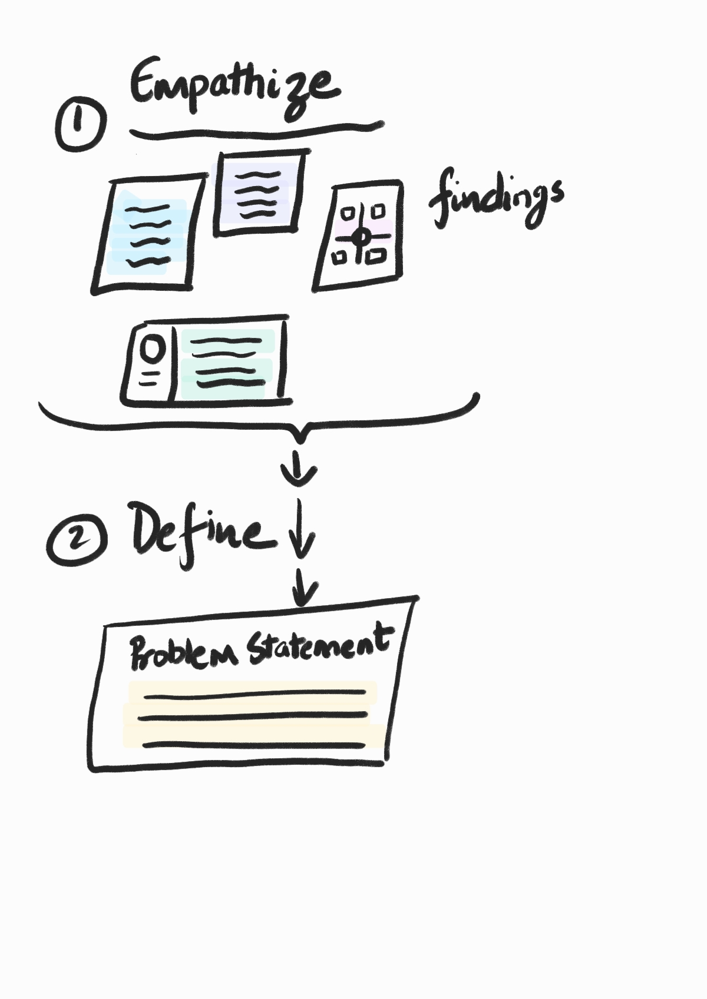

# Day 11 - Define

  

In define stage the information and insights gathered from the empathize stage are used to create a problem statement.

## References

1.[d.school Bootcamp Bootleg, 2018](https://static1.squarespace.com/static/57c6b79629687fde090a0fdd/t/5b19b2f2aa4a99e99b26b6bb/1528410876119/dschool_bootleg_deck_2018_final_sm+%282%29.pdf)