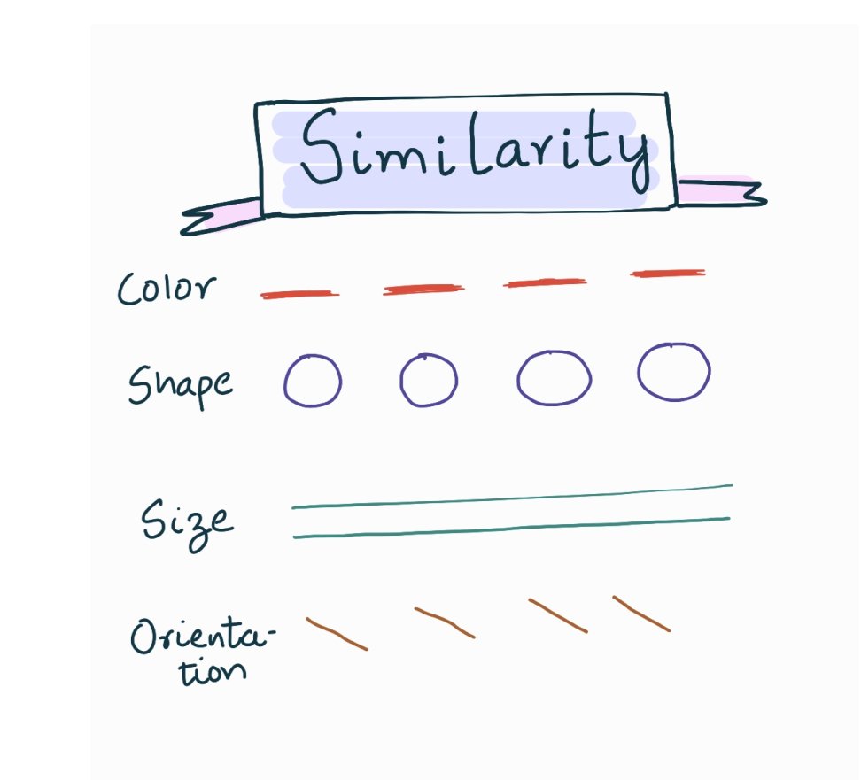

# Day 24 - Similarity

Elements that look similar are perceived to have the same function

For example, same colored items are perceived to serve the same function

  

### References

- Google UX Design Certificate Course on Coursera
- https://lawsofux.com/law-of-similarity/
