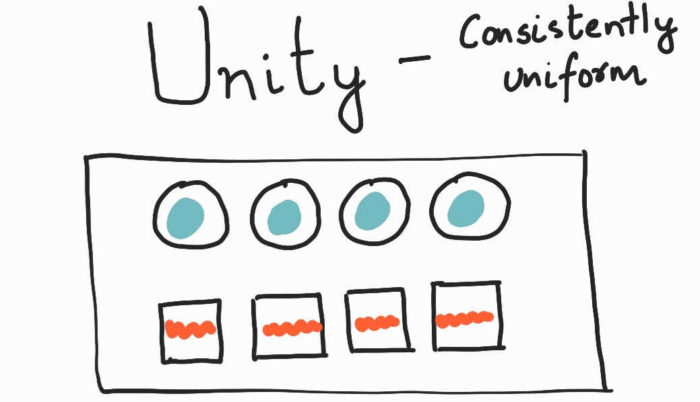
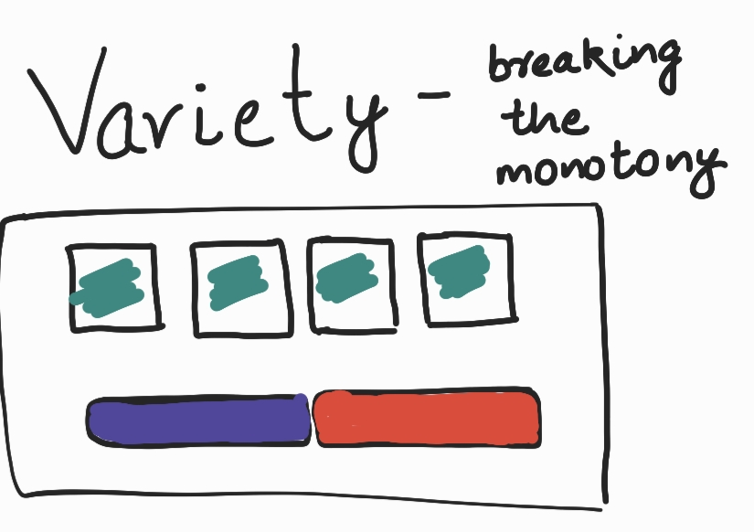

# Day 23 - Unity and Variety

## Unity

> measures how well elements of your design work together to communicate an idea

- It is created by using a consistent color scheme, complementary fonts, and consistent spacing.

  

## Variety

> varying the elements in your design to break up monotony.

- Users can have difficulty focusing if there's too much uniformity in the design.

  
### References

- Google UX Design Certificate Course on Coursera
